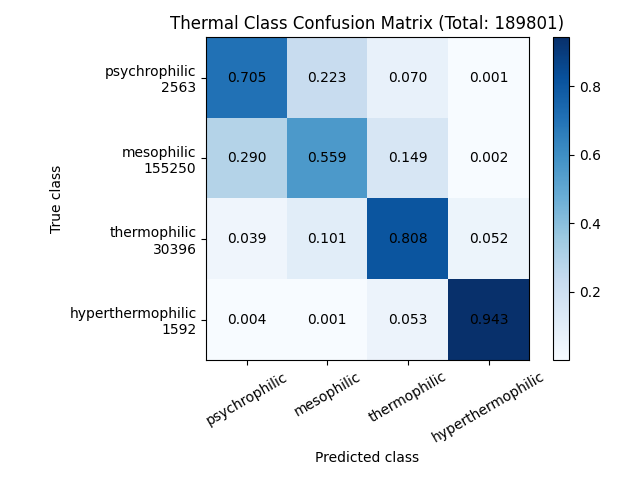
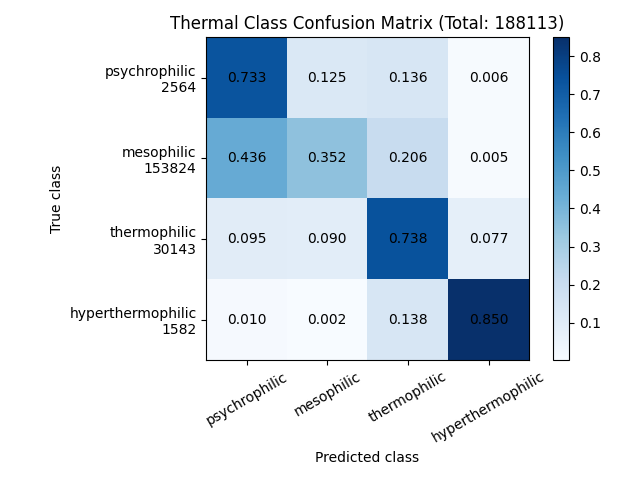

# Bachelor-thesis
Interpretability of large language models for classification of protein thermostability.

## Termal class borders
* **class : loose borders (tight borders)**
- Psychrophilic: < 20 °C (< 15 °C)
- Mesophilic: 20–45 °C (30 - 35 °C)
- Thermophilic: 45–80 °C (50 - 70 °C)
- Hyperthermophilic: > 80 °C (> 80 °C)

## Methods
### Captum
Integrated gradients ([source](https://captum.ai/docs/extension/integrated_gradients))

### Beyond Attention
Transformer Interpretability Beyond Attention Visualization ([source](https://arxiv.org/pdf/2012.09838))

## Resources
### Models
- Protein classificator by Lukas Kuhajda based on next
- General protein transformer by Facebook reaserch team ([Github repo](https://github.com/facebookresearch/esm))
### Datasets
#### Input datasets
- `200617_TEMPURA.json`: Data of microorganisms and their livable temperature: [Tempura](https://togodb.org/db/tempura)
- `uniref50.fasta`: Data of microorganisms and their known proteins: [Uniref50](https://ftp.uniprot.org/pub/databases/uniprot/current_release/uniref/uniref50/)
- `Pfam-A.fasta`: Data of protetin families: [Pfam](https://ftp.ebi.ac.uk/pub/databases/Pfam/current_release/)
#### Preprocessed datasets
- `prot_temp.json`: intermediate step in `processed_dataset.json` creation
- `processed_dataset.json`: useful combination of input datasets
    - created by *src/database_processor/make_database.py*
    - structure:
```javascript
{
    "PF10417": { //family ID
        "A0A6N7IUS6": { // protein ID
            "temp": 55.0, // ideal temperature
            "org": "Desulfotomaculum thermobenzoicum", // organism name
            "org_id": 29376, // organism ID
            "sequence": "MTAGW...TI", // whole DNA sequence
            "domain": "AV...YY" // domain sequence
        }
    }
}
```
- `clear_classes.json`: similar to `processed_dataset.json`, exclude proteins outside tight borders
    - created by *src/database_processor/filter_temp_gaps.py*
- `classified.json`: similar to `clear_classes.json`, each protein has new value of class probability (exept too long sequences, see neural_classification.py)
    - created by *src/database_processor/neural_classification.py*
```javascript
"pred": [
    1.3830351829528809,
    2.8963780403137207,
    -0.47536107897758484,
    -5.140520095825195,
]
```

#### Training datasets
- `mutants_min:13.71_hev:15.82.json`: list of protein domain and coresponding mutant (hyperthermophilic)
    - created by *src/training/naive_mutation_generator.py*
    - based on data in `processed_dataset.json`, takes only psychrophilic and mesophilic under length 500
    - average number of mutations is 13.71 (15.82 before cutting)
    - structure:
```javascript
[
    {
        "prot_id": "A0A1M6DL67",
        "domain": "DRDGLYAPANWEPGSTMVVPPTMSDEEAETGFAG",
        "mutant": "MRSGLYAPPNWEYGSTMVVPPTMSSEEAETGGAG"
    }
]
```

- `domain_attribution.dat`: saved importance attributions from `mutants_min:13.71_hev:15.82.json` using Captum
    - created by *src/training/collect_attributions.py* with *--mode domain* flag
    - saved tensor as numpy memmap
    - contein attribution for each residue (letter) to each class
    - shape: (number of residues, 1280)

- `mutant_attribution.dat`: same as `domain_attribution.dat`, just for mutants
    - created by *src/training/collect_attributions.py* with *--mode mutant* flag

- `X.dat` and `y.dat`: data for importance predictor training
    - created by *src/training/compile_atr_to_train_data.py*
    - input (2 * len(diff), 1280) and target (2 * len(diff), 1) (alternating 0 and 1)
    - for each residue that differ (domain vs mutant) has pair:
        - domain residue importance attribution - 0
        - mutant residue importance attribution - 1

    


## Results
### Transformer classificator confusion matrix
- created by *src/database_processor/create_confusion_matrix.py*

Whole sequences classification:



Domains classification:


